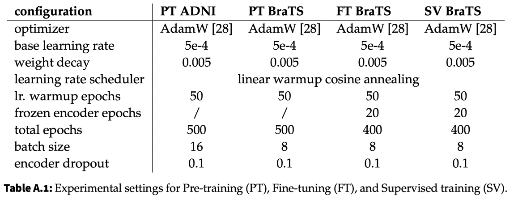

# SimMIM3D for Medical Image Data

### Overview

This project implements the SimMIM framework (Simple Framework for Masked Image Modeling) in 3D, specifically for medical image data.
The code in this repository constitutes the experimental work conducted for the bachelor thesis "Investigating the Efficacy of Masked Image Modeling for 3D Brain Tumor Segmentation".

The datasets used in the experiments are [ADNI](https://adni.loni.usc.edu/) (Alzheimer's Disease Neuroimaging Initiative) and [BraTS17](http://medicaldecathlon.com/) (Brain Tumor Segmentation Challenge).

This implementation follows the original 2D [SimMIM by Microsoft](https://github.com/microsoft/SimMIM) to handle 3D medical imaging data, offering potential advancements in medical image analysis. 
It uses [MONAI](https://monai.io/) and [Pytorch-Lightning](https://lightning.ai/pytorch-lightning).
---
### Installation

```shell
conda create -n SimMIM3D python=3.8 -y
conda activate SimMIM3D

git clone https://github.com/TimRiedel/SimMIM3D
cd SimMIM3D

pip install -r requirements.txt
pip install -e .

wandb login
```
---
### Usage
The code supports single-node, multi-GPU training.

Pre-training is supported for the [ADNI](https://adni.loni.usc.edu/) and [BraTS17](http://medicaldecathlon.com/) datasets.
To pre-train a model from scratch execute the following command from the project directory:
```shell
python3 src/main_simmim.py
    --project_name # wandb project
    --run_name # wandb run name
    --ckpt_dir # absolute path to directory in which to store checkpoints
    --logs_dir # absolute path to directory in which to store logs
    --dev_run # flag to set for executing a quick debugging run without logging
    --dataset # "adni" or "brats"
    --lr # base learning rate for training
    --mask_ratio # mask ratio to apply in pre-training
```

Fine-tuning is currently supported only for tumor segmentation on the [BraTS17](http://medicaldecathlon.com/) dataset. 
Use the following command:
```shell
python3 src/main_finetune.py
    --project_name # wandb project
    --run_name # wandb run name
    --ckpt_dir # absolute path to directory in which to store checkpoints
    --logs_dir # absolute path to directory in which to store logs
    --dev_run # flag to set for executing a quick debugging run without logging
    --dataset # "brats"
    --lr # base learning rate for training
    --train_frac # value from 0.0 to 1.0 indicating the amount of trainig data to use for fine-tuning
    --load_model # absolute path to model checkpoint with pre-trained weights for encoder
    --cv # number of cross-validation runs to execute
```
---
### Abstract
Medical image segmentation is essential for diagnosing and treating diseases but is labor-intensive for healthcare professionals.
Given the limited availability of accurately segmented data, training efficient machine learning models to automate this task becomes challenging.

This thesis explores the potential of Masked Image Modeling (MIM), a self-supervised learning technique, to address this issue by leveraging unlabeled data.
During pre-training, a transformer-based network is tasked with reconstructing masked image sections, thereby learning an intrinsic understanding of the data.
Subsequently, the model is fine-tuned to a brain tumor segmentation task with varying amounts of labeled data.

The results show that MIM pre-training is superior to fully supervised training with random weight initialization, improving dice scores by 5 to 10 percentage points on smaller datasets.
Masking ratios in pre-training of 0.2, 0.5, and 0.6 are effective over a wide range of labeled data.
However, the experiments exhibit large variability in accuracy, especially on smaller datasets, signaling a need for further refinement in model training.
Pre-training on diverse, large datasets typically outperforms self-pretraining on the same dataset, which is especially pronounced when fine-tuning models with large amounts of segmented data.
Moreover, it can be beneficial to partially freeze the encoder weights during fine-tuning and therefore preserve the data representation learned during pre-training.

In essence, these experiments validate the efficacy of Masked Image Modeling and establish a promising foundation for advancing medical image segmentation with limited datasets.
This represents a significant step towards automating labor-intensive segmentation tasks for disease diagnosis and treatment.
---
### Experimental Settings
**Encoder:** All experiments used a standard ViT-B encoder architecture, with a patch size of 16, an embedding size of 768 and 12 transformer blocks.

**Decoder:** The SimMIM decoder consisted of a single SubpixelUpsample layer from [MONAI](https://monai.io/).
The decoder for segmentation followed the standard UNETR-decoder from [MONAI](https://monai.io/).

**Data augmentation:** Images were scaled and cropped to `128x128x128` pixels for both datasets.
A random flip in all axes, adjustment of contrast, intensity scaling, and intensity shifting concluded the data augmentation pipeline for training images.

**Weight Transfer:** For fine-tuning, all weights of the pre-trained ViT encoder were transferred to the UNETR model.
Solely the patch embedding weights were discarded to account for the higher number of modalities in the [BraTS17](http://medicaldecathlon.com/) dataset compared to the [ADNI](https://adni.loni.usc.edu/) dataset used for pre-training.

**Weight Freezing:** Unless otherwise stated, the encoder was frozen for the initial 20 epochs during fine-tuning.

**Loss Function:** All pre-training experiments used an L1 loss function.
A Dice-Loss was used for the fine-tuning experiments.



---
### Experimental Findings


---
### Acknowledgements

* Special thanks to my supervisors for their guidance and support.

---

**Author**: Tim Riedel

**Affiliation**: Student at Hasso-Plattner-Institute (HPI), University of Potsdam

For any issues, questions, or feedback, please raise an issue in this repository.